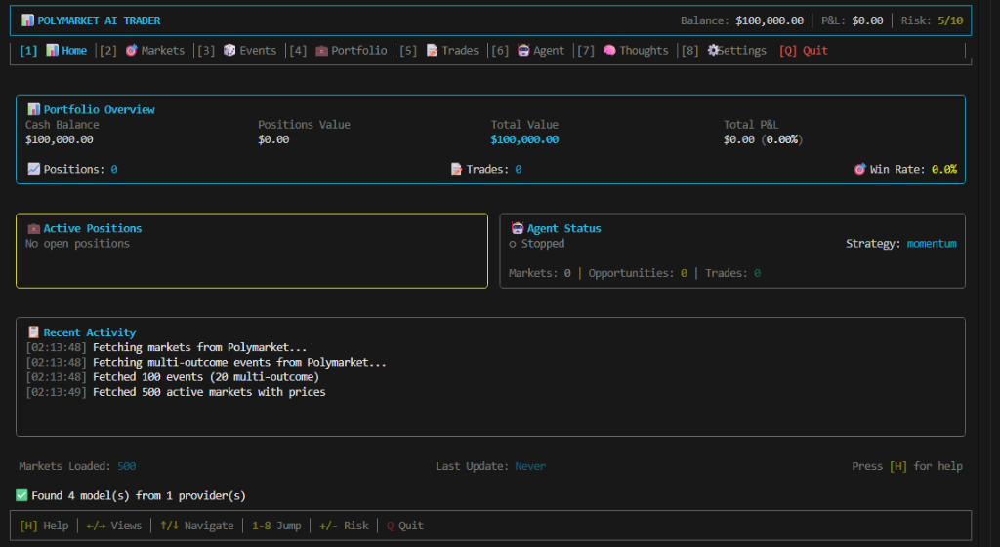
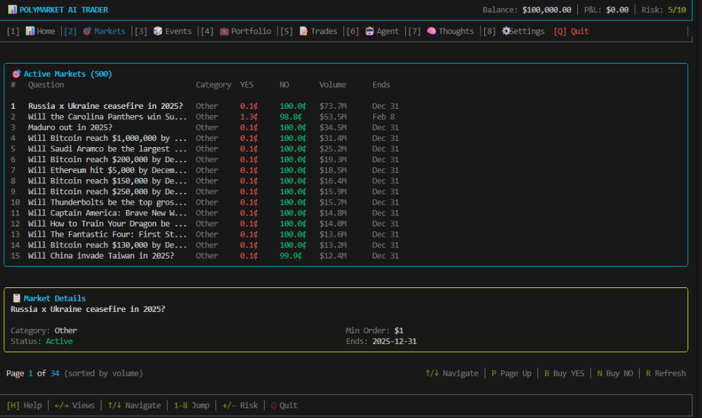
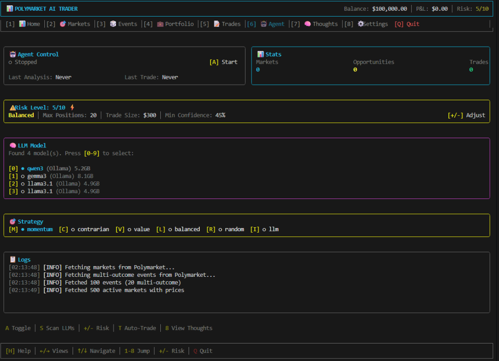
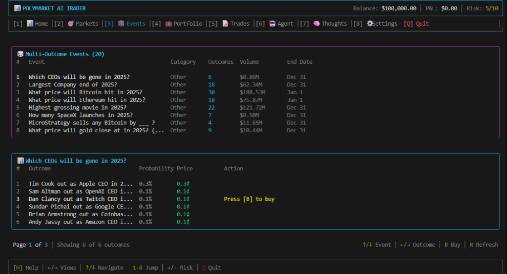

# Polymarket Paper Trading Agent 🎯

A terminal-based AI paper trading agent for [Polymarket](https://polymarket.com) prediction markets. Simulate trading with $100,000 virtual balance to see how AI agents behave in prediction market environments.



## ✨ Features

- 📊 **Paper Trading** - Trade prediction markets with fake money ($100k starting balance)
- 🤖 **AI Agent** - Automated trading with 6 strategies including LLM-powered analysis
- 🧠 **Local LLM Support** - Uses Ollama models (Llama, Gemma, Qwen) for intelligent trading decisions
- 💼 **Portfolio Tracking** - Real-time P&L, positions, and trade history
- 🎯 **Live Market Data** - Real prices from Polymarket API (500+ markets)
- 🎲 **Multi-Outcome Markets** - Full support for events like Super Bowl, elections, Bitcoin price targets
- ⌨️ **Terminal UI** - Beautiful, keyboard-driven interface built with Ink/React

## 🚀 Quick Start

```bash
# Install dependencies
npm install

# Run the agent
npm run dev
```

## 📸 Screenshots

### Markets View
Browse 500+ active prediction markets sorted by volume. Buy YES or NO positions with a single keypress.



### Agent Control
Configure AI trading strategies, select LLM models, and adjust risk parameters.



### Multi-Outcome Events
Trade on complex events with multiple outcomes like "Which CEOs will be gone in 2025?" or Bitcoin price targets.



## 🎮 Views

| # | View | Description |
|---|------|-------------|
| 1 | **Dashboard** | Portfolio overview, positions, agent status, activity log |
| 2 | **Markets** | Binary YES/NO prediction markets (500+ sorted by volume) |
| 3 | **Events** | Multi-outcome events (Super Bowl, elections, price targets) |
| 4 | **Portfolio** | Your positions and P&L breakdown |
| 5 | **Trades** | Complete trade history with realized P&L |
| 6 | **Agent** | AI agent controls, LLM model selection, strategy picker |
| 7 | **Thoughts** | See the LLM's reasoning and analysis in real-time |
| 8 | **Settings** | Configuration and API settings |

## ⌨️ Keyboard Controls

### Global
| Key | Action |
|-----|--------|
| `1-8` | Jump to view |
| `←/→` | Navigate between views |
| `↑/↓` | Navigate lists |
| `+/-` | Adjust risk level |
| `H` | Toggle help |
| `Q` | Quit |

### Markets View
| Key | Action |
|-----|--------|
| `B` | Buy YES on selected market |
| `N` | Buy NO on selected market |
| `P` | Page up (jump 15 markets) |
| `R` | Refresh markets |

### Events View
| Key | Action |
|-----|--------|
| `↑/↓` | Navigate between events |
| `←/→` | Select outcome within event |
| `B` | Buy selected outcome |
| `R` | Refresh events |

### Agent View
| Key | Action |
|-----|--------|
| `A` | Start/Stop agent |
| `0-9` | Select LLM model |
| `M/C/V/L/R/I` | Change strategy |
| `T` | Toggle auto-trade |
| `S` | Scan for LLMs |

## 🤖 Trading Strategies

| Key | Strategy | Description |
|-----|----------|-------------|
| `M` | **Momentum** | Follow trends, buy when probability is rising |
| `C` | **Contrarian** | Buy undervalued outcomes against the crowd |
| `V` | **Value** | Target balanced markets near 50/50 |
| `L` | **Balanced** | Combination of all strategies |
| `R` | **Random** | Random trading (baseline comparison) |
| `I` | **LLM** | AI-powered analysis using local language models |

### LLM Strategy
When using the LLM strategy, the agent:
1. Pre-filters to the top 10 most uncertain markets (prices between 10-90%)
2. Analyzes each market using chain-of-thought reasoning
3. Considers your risk level and existing positions
4. Makes buy/sell/hold decisions with confidence scores

Supports Ollama models: Llama 3.1, Gemma 3, Qwen 3, and more.

## 🎲 Multi-Outcome Markets

The agent fully supports multi-outcome events like:
- 🏈 Super Bowl Champion
- 🗳️ Political elections with multiple candidates
- 📊 Bitcoin/Ethereum price targets
- 🎬 Highest grossing movie
- 👔 CEO departures

Each event shows all possible outcomes with their probabilities and allows buying any outcome.

## ⚙️ Configuration

Edit `.env` file to customize:

```env
# Starting balance
INITIAL_BALANCE=100000

# Risk limits
MAX_POSITION_SIZE=10000
MAX_POSITIONS=10

# Agent settings
AGENT_STRATEGY=balanced
AUTO_TRADE=false
TRADE_INTERVAL_MS=60000

# LLM settings (optional)
OLLAMA_MODEL=llama3.1:8b
```

## 🏗️ Architecture

```
src/
├── api/          # Polymarket API client
│   ├── client    # Gamma + CLOB API integration
│   └── types     # Market, Event, Token types
├── engine/       # Paper trading engine
│   ├── balance   # Virtual balance management
│   ├── positions # Position tracking
│   └── trades    # Trade execution
├── agent/        # AI trading agent
│   ├── analyzer  # Market analysis (6 strategies)
│   ├── llm       # LLM integration (Ollama)
│   ├── risk      # Risk management
│   └── agent     # Main controller
└── ui/           # Terminal UI (Ink/React)
    ├── views/    # Dashboard, Markets, Events, Agent, etc.
    └── components/
```

## 🌐 API

This project uses two Polymarket APIs:
- **Gamma API** (`gamma-api.polymarket.com`) - Events and market data
- **CLOB API** (`clob.polymarket.com`) - Order books and pricing

No authentication required for read-only operations.

## 📄 License

MIT

## ⚠️ Disclaimer

This is a paper trading simulator for educational purposes only. No real money is involved. This project is not affiliated with Polymarket.
